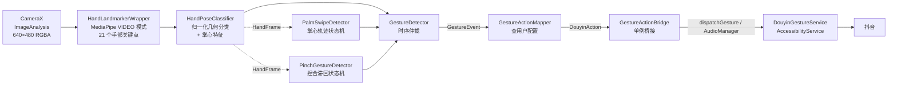

# 手势控抖音 · DouyinGestureControl

> 用摄像头看你的手，隔空刷抖音。
> 手是湿的、脏的、沾着面粉或沐浴露时，不必碰屏幕——张掌一挥切视频，握拳再张开点赞，拇指食指捏合调音量。

**Kotlin · CameraX · MediaPipe Hand Landmarker · Android AccessibilityService · Jetpack Compose**

[](https://kotlinlang.org)
[](https://developer.android.com)
[](https://ai.google.dev/edge/mediapipe)
[](https://developer.android.com/build)
[](./)

---

## 目录

- [它能做什么](#它能做什么)
- [快速开始](#快速开始)
- [默认手势对照表](#默认手势对照表)
- [自定义手势映射](#自定义手势映射)
- [架构与数据流](#架构与数据流)
- [识别管线详解](#识别管线详解)
- [关键参数与调参](#关键参数与调参)
- [权限说明](#权限说明)
- [常见问题与排障](#常见问题与排障)
- [测试](#测试)
- [项目结构](#项目结构)
- [已知限制与后续计划](#已知限制与后续计划)
- [免责声明](#免责声明)

---

## 它能做什么

| 能力               | 说明                                                         |
| ------------------ | ------------------------------------------------------------ |
| 🖐 **10 种手势**    | 张掌上/下挥、握拳张开、V 字、张掌保持、捏合/张开、单指指向、OK、摇滚 |
| 🎬 **9 种抖音操作** | 上/下一个视频、点赞、评论区开关、暂停/播放、音量 ±、禁用     |
| 🎛 **自由映射**     | 任意手势 → 任意操作，配置页下拉即可改，保存后立即生效        |
| 🔒 **后台持续识别** | 前台服务 + 摄像头用例，切到抖音全屏后手势照样生效            |
| 🎯 **控件精准定位** | 优先用无障碍节点树找「点赞」「评论」按钮，找不到自动回退到比例坐标 |
| 🛡 **防误触**       | 跨帧投票 + 滞回状态机 + 全局冷却，晃动、丢帧、姿态抖动不会乱触发 |
| 🔋 **保活设计**     | 电池优化白名单、屏幕常亮、ROM 清理后的自动重连提示           |
| 🧪 **可测试**       | 识别逻辑与 Android 解耦，7 个纯 JUnit 测试覆盖分类器与状态机 |

**典型场景**：洗澡时手机挂墙上、做饭时满手油污、躺床上懒得抬手、冬天戴半指手套。

---

## 快速开始

### 前置条件

| 项目         | 要求                                                         |
| ------------ | ------------------------------------------------------------ |
| Android 系统 | 8.0（API 26）及以上，推荐 11+                                |
| 摄像头       | 必须有前置摄像头                                             |
| 目标 App     | 抖音（含极速版 / TikTok 包名已列入 `<queries>`）             |
| 开发环境     | Android Studio Koala+ / JDK 17 / Gradle 8.7（已随 wrapper 提供） |
| 网络         | 首次拉取依赖需要联网（已配置阿里云 + 腾讯云镜像，国内友好）  |

### 1. 克隆 & 准备模型

MediaPipe 模型文件约 **7.5 MB**，仓库 `app/src/main/assets/` 内已内置一份；若缺失（例如你做了 clean），用脚本重新拉取：

```bash
# Windows PowerShell
powershell -ExecutionPolicy Bypass -File download_model.ps1

# 或直接双击项目根目录的 download_model.bat
```

手动下载（脚本失败时）：

```
https://storage.googleapis.com/mediapipe-models/hand_landmarker/hand_landmarker/float16/1/hand_landmarker.task
```

下载后重命名为 `hand_landmarker.task`，放到 `app/src/main/assets/`。

> ⚠️ 国内直连 `storage.googleapis.com` 通常需要代理。

### 2. 编译安装

```bash
./gradlew assembleDebug        # 构建 Debug APK
./gradlew installDebug         # 安装到已连接设备
```

### 3. 三步开启

1. **授予摄像头权限** —— 首次启动自动弹窗，允许即可。
2. **开启无障碍服务** —— 主界面点「去开启无障碍服务」→ 在设置里找到 **手势控制抖音无障碍服务** → 打开开关。
3. **点「开启手势控制」** —— 状态卡片四项全绿即就绪，然后点「打开抖音」开始隔空操作。

> 💡 建议顺手点一次「加入电池优化白名单」，能显著降低被系统杀进程的概率。

---

## 默认手势对照表

|   手势   | 动作要领                    | 默认触发           | 可调 |
| :------: | --------------------------- | ------------------ | :--: |
|   上挥   | 张开手掌，向上挥动          | 下一个视频         |  ✅   |
|   下挥   | 张开手掌，向下挥动          | 上一个视频         |  ✅   |
| 握拳张开 | 握拳后快速张开（900ms 内）  | 双击点赞           |  ✅   |
| V 字保持 | 食指 + 中指伸出，保持 500ms | 打开评论区         |  ✅   |
| 手掌保持 | 张开手掌静止约 700ms        | 暂停 / 播放        |  ✅   |
|   捏合   | 拇指食指靠近                | 音量 −             |  ✅   |
|   张开   | 拇指食指分开                | 音量 +             |  ✅   |
| 指向保持 | 仅食指伸出，保持 500ms      | 关闭评论区         |  ✅   |
| OK 手势  | 拇指食指成圈，其余伸直      | *禁用（待你分配）* |  ✅   |
| 摇滚手势 | 食指 + 小指伸出             | *禁用（待你分配）* |  ✅   |

可选动作：`下一个视频` `上一个视频` `点赞` `评论区` `关闭评论区` `暂停/播放` `音量+` `音量-` `禁用`。

---

## 自定义手势映射

主界面 → **手势配置 · 自定义映射**，每一张卡片包含：

- 用 Canvas 代码绘制的手势示意图（无图片资源依赖）
- 手势名 + 说明文字
- 下拉菜单选择目标动作，选到「禁用」即关闭该手势

映射通过 `SharedPreferences`（`gesture_mapping`）持久化，`MappingRepository` 持有内存缓存，识别端每次映射都读缓存 —— **保存即生效，无需重启服务**。右上角 ↺ 可一键恢复默认。

---

## 架构与数据流



**设计要点：**

- **三层解耦**：`GestureEvent`（识别语义）→ `DouyinAction`（业务动作）→ `AccessibilityService`（执行）。识别端不知道"抖音"，执行端不知道"MediaPipe"。
- **单例桥接**：`GestureActionBridge` 让前台服务中的识别线程与无障碍服务互不持有引用，生命周期清晰；无障碍服务未就绪时动作被安全丢弃并记日志。
- **一帧最多一个事件**：`GestureDetector` 按 `滑动 > 姿态跃迁 > 捏合 > 保持` 的优先级取第一个非 `None` 事件，避免一次挥手同时触发点赞和音量。
- **崩溃隔离**：`AccessibilityService` 生命周期回调全部 try-catch 包裹 —— 无障碍服务一旦抛异常会被系统直接禁用，用户就得去设置里手动重开。

---

## 识别管线详解

### 1. 取帧与关键点

`CameraForegroundService` 继承 `LifecycleService`，绑定前摄的 `ImageAnalysis` 用例：

- 输出格式 `RGBA_8888`，避免 YUV 行/像素步长处理错误
- 分辨率锁 **640×480**（480p 足够识别手部，每帧内存从 720p 的 ~3.6MB 降到 ~1.8MB，显著缓解 GC 压力）
- `RgbaImageConverter` 把带行填充的 plane 紧凑复制并旋转为正立 Bitmap
- **直接使用 CameraX 原始时间戳**（纳秒→毫秒）。早期版本曾强制相邻帧差 1ms，会破坏 MediaPipe VIDEO 模式的跨帧跟踪，导致跟踪 ID 频繁重置、关键点跳变。

MediaPipe 运行在 `RunningMode.VIDEO`，`numHands=1`，置信度阈值 **0.5 / 0.5 / 0.6**（检测 / 存在 / 跟踪），返回每只手 21 个归一化关键点。

### 2. 单帧姿态分类

`HandPoseClassifier` 用归一化几何判定 8 种姿态（`OPEN_PALM` `FIST` `V_SIGN` `POINT` `OK_SIGN` `ROCK_SIGN` `OTHER` `NONE`）：

- **伸直判定**：关节夹角 ≥ 140° **且** 指尖-手腕距离 / 掌长 ≥ 1.3
- **弯曲判定**：关节夹角 < 120° **或** 距离比 < 1.3 —— 与伸直判定**互相独立**，避免"放宽伸直阈值导致握拳被误判为伸直"
- **握拳**：四指全弯曲 + `isClosedFist` 双重确认
- 同时输出掌心坐标、掌宽、伸直手指数、捏合比例（`pinchRatio`）供下游使用

### 3. 时序仲裁

| 检测器                 | 职责                             | 抗噪手段                                                     |
| ---------------------- | -------------------------------- | ------------------------------------------------------------ |
| `PalmSwipeDetector`    | 掌心上/下挥动                    | IDLE→ARMED→TRACKING→FIRED 状态机；位移按掌宽归一化（远近手一致）；容忍 160ms 丢帧与姿态误分类；逐步长一致性 ≥ 65%；抑制单帧跳变 |
| `PinchGestureDetector` | 拇指食指捏合 / 张开              | 滞回状态机（0.30 闭 / 0.55 开）；120ms 连续确认；初始只建基线不发事件；转换期间暂缓 `PointHold` 防止抢先 |
| `GestureDetector`      | 姿态投票 + 保持类手势 + 全局仲裁 | 400ms 窗口内 ≥5 帧、占比 ≥70% 才认定稳定姿态；180ms 姿态确认；保持时长 500~700ms；250ms 无手重置；**400ms 全局冷却** |

> 📌 为什么要独立的滑动 / 捏合检测器？
> 实机日志显示，手掌移动时 MediaPipe 的关键点会因运动模糊、透视变化、部分遮挡而抖动，静态分类结果在 `FIST` / `V_SIGN` / `OTHER` 之间反复跳变，**几乎从不**稳定为 `OPEN_PALM`。继续放宽静态阈值会让点赞、评论等静态手势一起失控。因此动态手势改由**运动特征 + 独立状态机**处理，静态阈值得以保持严格。

### 4. 执行

`DouyinGestureService`（`AccessibilityService`）负责真正的模拟操作：

| 动作                | 实现方式                                                     |
| ------------------- | ------------------------------------------------------------ |
| 上一个 / 下一个视频 | `dispatchGesture`，屏幕 75%↔25% 高度线性滑动，350ms          |
| 点赞                | 先按 `contentDescription` 含「点赞」查无障碍节点 → 取其屏幕坐标双击（50ms 点击 + 80ms 间隔）；失败回退屏幕中央双击 |
| 评论区              | 同上，查找含「评论」的节点；失败回退 (0.92, 0.58) 比例坐标   |
| 关闭评论区          | `performGlobalAction(GLOBAL_ACTION_BACK)`                    |
| 暂停 / 播放         | 屏幕中央单击                                                 |
| 音量 ±              | `AudioManager.adjustStreamVolume(STREAM_MUSIC, ...)`         |

节点查找会**过滤屏幕外节点** —— 信息流里滚出去的视频项按钮 `getBoundsInScreen` 会返回负坐标，直接喂给 `Path.moveTo` 会抛 `IllegalArgumentException`。

---

## 关键参数与调参

所有阈值都集中在各自的 `Config` 数据类里，改一个数字即可，无需动逻辑。

**`GestureDetector.Config`**（`gesture/GestureDetector.kt`）

| 参数                                     | 默认            | 含义                                   |
| ---------------------------------------- | --------------- | -------------------------------------- |
| `voteWindowMs`                           | 400             | 姿态投票时间窗口                       |
| `minVoteFrames` / `voteRatio`            | 5 / 0.70        | 窗口内最少帧数与主导姿态占比           |
| `poseConfirmMs`                          | 180             | 候选姿态升级为稳定姿态所需时间         |
| `globalCooldownMs`                       | 400             | 两次事件之间的最小间隔                 |
| `vHoldMs` / `palmHoldMs` / `pointHoldMs` | 500 / 700 / 500 | 各类保持手势的触发时长                 |
| `stillDisplacement`                      | 0.07            | 张掌保持允许的位移（约 34 像素 @480p） |
| `fistToOpenWindowMs`                     | 900             | 握拳→张开判定为点赞的有效窗口          |

**`PalmSwipeDetector.Config`**：`minVerticalPalmWidths 0.55`、`maxHorizontalPalmWidths 0.55`、`directionRatio 0.65`、`minOpenFingerCount 3`、`maxTrackMs 700`

**`PinchGestureDetector.Config`**：`closedRatio 0.30`、`openRatio 0.55`、`confirmMs 120`

**`HandPoseClassifier` 常量**：`MIN_EXTENDED_ANGLE_DEGREES 140`、`MIN_TIP_DISTANCE_RATIO 1.3`、`MAX_CURLED_ANGLE_DEGREES 120`、`OK_PINCH_RATIO 0.35`

> 觉得太灵敏 → 调大 `globalCooldownMs` 与各类 `HoldMs`；觉得不跟手 → 调小 `voteRatio`、`stillDisplacement` 调大。识别层的每一步都有 `onDiagnostic` 日志（tag `CameraManager` / `PalmSwipeDetector`），调参时先看日志再动数字。

---

## 权限说明

| 权限                                               | 用途                                                      |
| -------------------------------------------------- | --------------------------------------------------------- |
| `CAMERA`                                           | 采集手部图像                                              |
| `FOREGROUND_SERVICE` / `FOREGROUND_SERVICE_CAMERA` | 后台持续识别（Android 14+ 强制声明类型）                  |
| `SYSTEM_ALERT_WINDOW`                              | 部分机型（如小米）后台创建摄像头 Preview Surface 所需     |
| `WAKE_LOCK` + `FLAG_KEEP_SCREEN_ON`                | 防止息屏导致识别中断                                      |
| `REQUEST_IGNORE_BATTERY_OPTIMIZATIONS`             | 豁免 Doze / 电池优化杀进程                                |
| **无障碍服务**                                     | 跨 App 模拟滑动与点击（**必须用户手动在系统设置中开启**） |

无障碍服务配置位于 `app/src/main/res/xml/gesture_service_config.xml`：
`canPerformGestures=true`、`canRetrieveWindowContent=true`、`packageNames` 仅限定抖音（避免误触发其他 App 并省电）。

**隐私声明**：摄像头画面只在设备本地内存中逐帧处理，不存储、不上传、不联网，无任何图像采集或上报代码。

---

## 常见问题与排障

**Q：状态卡片「手势识别」不亮，服务起不来？**
检查 `app/src/main/assets/hand_landmarker.task` 是否存在。缺失时日志会打印 `HandLandmarker 未就绪`，服务会自行 `stopSelf()`。

**Q：清理后台后无障碍服务被关了？**
这是 ROM 行为（日志可见 MIUI 的 `SwipeUpClean` 强制停止进程），普通应用无法绕过。已做的缓解：申请电池白名单 + 屏幕常亮。若开关本身还在**开启**状态，重新打开本 App 系统会自动重连；若开关被系统关掉了，需要到手机管家把本 App 加入「允许自启动 / 后台运行 / 不清理」白名单。

**Q：点赞 / 评论点偏了？**
优先走节点查找，理论上不依赖机型坐标；若抖音改版导致 `contentDescription` 变化，会自动回退到比例坐标（评论按钮 0.92 / 0.58）。此时可按机型微调 `DouyinGestureService` 里的 `COMMENT_X_RATIO` / `COMMENT_Y_RATIO`。

**Q：挥手没反应 / 反应过度？**
看日志。`PalmSwipeDetector` 会在 500ms 间隔输出「掌心轨迹候选: dyPalm=..., dxPalm=..., openRatio=...」，据此判断是位移不够（`minVerticalPalmWidths`）还是被判定为横向移动。

**Q：捏合调音量没反应？**
捏合检测器首帧只建立基线、不发事件，需先做一次完整的开→合或合→开。若整个过程被静态分类为 `POINT` 也能正常工作（这正是独立检测器存在的意义）。

**Q：Gradle 拉不到依赖？**
项目已配置阿里云 Maven 镜像与腾讯云 Gradle 分发镜像（`gradle-8.7-bin.zip`），一般无需代理。若仍失败，检查 `settings.gradle.kts` 中的仓库顺序。

---

## 测试

识别逻辑全部为纯 Kotlin，无 Android 依赖，可直接在 JVM 上跑：

```bash
./gradlew test          # 单元测试
./gradlew lint          # Android Lint
./gradlew assembleDebug # 构建校验
```

| 测试                           | 覆盖内容                                   |
| ------------------------------ | ------------------------------------------ |
| `HandPoseClassifierTest`       | 八种姿态的几何判定与边界阈值               |
| `PalmSwipeDetectorTest`        | 状态机转换、位移归一化、丢帧容忍、跳变抑制 |
| `PinchGestureDetectorTest`     | 滞回阈值、基线建立、转换确认               |
| `GestureDetectorDynamicTest`   | 连续帧序列下的事件产出                     |
| `GestureDetectorStabilityTest` | 单点噪声与抖动下的稳定性                   |
| `RgbaImageConverterTest`       | 行/像素步长、旋转、异常输入                |
| `AcceptedActionTrackerTest`    | 动作回执记录                               |

---

## 项目结构

```
DouyinGestureControl/
├── app/src/main/java/com/gesturecontrol/douyin/
│   ├── MainActivity.kt              # 入口：权限请求、屏幕常亮、Compose 导航
│   ├── camera/
│   │   └── CameraManager.kt         # ImageAnalysis.Analyzer：取帧 → 检测 → 派发
│   ├── gesture/
│   │   ├── HandLandmarkerWrapper.kt # MediaPipe 封装（VIDEO 模式）
│   │   ├── RgbaImageConverter.kt    # 带行填充的 RGBA plane → 正立 Bitmap
│   │   ├── HandPoint.kt             # HandPoint / HandPose / HandFrame
│   │   ├── HandPoseClassifier.kt    # 单帧归一化几何分类
│   │   ├── PalmSwipeDetector.kt     # 掌心轨迹滑动状态机
│   │   ├── PinchGestureDetector.kt  # 捏合滞回状态机
│   │   ├── GestureDetector.kt       # 投票 + 保持 + 全局仲裁
│   │   ├── GestureEvent.kt          # 识别端语义事件
│   │   ├── GestureActionMapper.kt   # Event → Action
│   │   ├── PresetGesture.kt         # 10 种预设手势 + Canvas 示意图 + 默认映射
│   │   └── MappingRepository.kt     # SharedPreferences 持久化
│   ├── action/
│   │   ├── DouyinAction.kt          # 业务动作定义
│   │   ├── GestureActionBridge.kt   # 识别端 ↔ 执行端单例桥接
│   │   └── AcceptedActionTracker.kt # 动作回执记录
│   ├── service/
│   │   ├── CameraForegroundService.kt # 前台服务：摄像头持续识别
│   │   └── DouyinGestureService.kt    # 无障碍服务：模拟手势
│   └── ui/
│       ├── MainScreen.kt / MainViewModel.kt      # 主界面
│       └── GestureMappingScreen.kt / MappingViewModel.kt  # 手势配置页
├── app/src/main/assets/hand_landmarker.task   # MediaPipe 模型（~7.5MB）
├── docs/superpowers/                          # 设计文档与实施计划
│   ├── specs/   # 可靠性 / 识别准确率 / 掌心轨迹 / 独立捏合 四份设计
│   └── plans/   # 对应的 task-by-task 实施计划
├── download_model.ps1 / .bat                  # 模型下载脚本
└── build.gradle.kts / settings.gradle.kts
```

技术栈：Kotlin 1.9.24 · AGP 8.5.2 · Gradle 8.7 · compileSdk 34 · minSdk 26 · targetSdk 34 · CameraX 1.3.4 · MediaPipe Tasks Vision 0.10.14 · Compose BOM 2024.06.00 (Material3) · Coroutines 1.8.1 · JUnit 4.13.2

> `docs/superpowers/` 下保留了完整的四份设计文档与实施计划，记录了每个阈值背后的实机证据（例如为什么静态分类在手掌移动时几乎从不输出 `OPEN_PALM`）。想改识别逻辑的话，建议先读它们。

---

## 已知限制与后续计划

**已知限制**

- 仅支持**单手**识别（`numHands = 1`）
- 需要环境光线充足，强逆光或全黑环境下关键点会丢失
- 抖音 UI 改版可能导致 `contentDescription` 变化，届时会回退到比例坐标
- 未适配折叠屏 / 平板的多窗口布局
- 无障碍服务依赖系统调度，极端低电量模式下可能被系统回收
- 无障碍服务仅限抖音包名（`com.ss.android.ugc.aweme`），TikTok 国际版需自行扩展

**后续计划**

- [ ] 双手手势（如双手捏合缩放）
- [ ] 手势灵敏度分级（保守 / 标准 / 激进三档预设）
- [ ] 实时预览浮窗（可选开关，便于对准摄像头）
- [ ] 支持更多 App（快手、B站、Reels）
- [ ] 识别帧率与耗时面板（便于调参）
- [ ] 手势录制与自定义动作序列

---

## 免责声明

本项目为**个人学习与技术研究用途**，通过 Android 官方 `AccessibilityService` API 模拟用户手势，不修改、不注入、不逆向抖音，不采集或上传任何图像与个人数据。

请遵守当地法律法规与抖音的用户协议，勿用于刷量、养号、自动化营销等违反平台规则的用途。因使用本项目产生的任何后果由使用者自行承担。

---

## 参考

- [MediaPipe Hand Landmarker](https://ai.google.dev/edge/mediapipe/solutions/vision/hand_landmarker)
- [CameraX ImageAnalysis](https://developer.android.com/media/camera/camerax/analyze)
- [Android AccessibilityService](https://developer.android.com/reference/android/accessibilityservice/AccessibilityService)
- [GestureDescription / dispatchGesture](https://developer.android.com/reference/android/accessibilityservice/GestureDescription)
